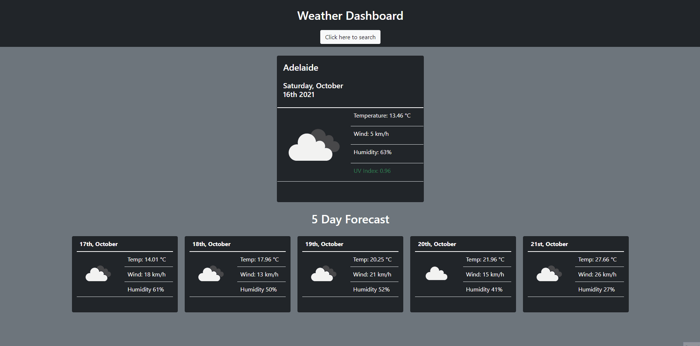

# Week 6 - University of Adelaide Coding Boot Camp

## Server-side APIS: Weather Dashboard

 

## Tasks includes

- [x] To create a weather app for multiple cities

- [x] To have a form input for user to search for a city

- [x] To present current and future weather conditions of the city

- [x] To have a search history saved in the local storage

- [x] To present the city's name, date, icon of the weather condition, temperature, humidity, wind speed and the UV index.

- [x] To show if the UV index is favorable, moderate or severe

- [x] To present a 5-day forecast that displays the date, icon of weather conditions, temperature, wind speed and the humidity

- [x] To have a working search history

## Sample of the webpage

> Note: I've added a geolocation API to show the user's IP location weather conditions on page load.

 

 

## View the web page here

https://carlsantiago.github.io/weather-app/

---

© Carl Santiago\
📧 4518gg@gmail.com
